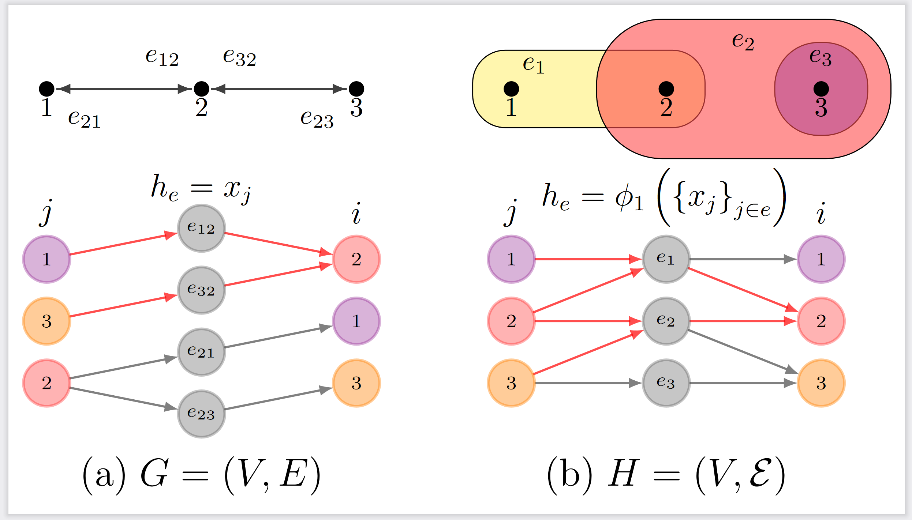

# UniGNN

This repository contains the source code for the paper [_UniGNN: a Unified Framework for Graph and Hypergraph Neural Networks_](https://arxiv.org/abs/2105.00956), accepted by IJCAI 2021.




## Citation

If you find this work useful in your research, please consider cite: 

```bibtex
@inproceedings{ijcai21-UniGNN,
  title     = {UniGNN: a Unified Framework for Graph and Hypergraph Neural Networks},
  author    = {Huang, Jing and Yang, Jie},
  booktitle = {Proceedings of the Thirtieth International Joint Conference on
               Artificial Intelligence, {IJCAI-21}},
  year      = {2021}
}
```


## Getting Started

### Prerequisites

Our code requires Python>=3.6. 

We recommed using virtual environtment and  install the newest versions of  [Pytorch](https://pytorch.org/) and [Pytorch-Geometric](https://github.com/rusty1s/pytorch_geometric).


You also need these additional packages:

* scipy
* path
* tqdm


## Download Datasets

Please download the datasets from [HyperGCN](https://github.com/malllabiisc/HyperGCN) and copy the `data` directory into this repository.

### Baselines

Baseline results can be found in [HyperSAGE](https://openreview.net/forum?id=cKnKJcTPRcV), [HyperGCN](https://github.com/malllabiisc/HyperGCN) or [MPNN-R](https://github.com/naganandy/G-MPNN-R).

## Semi-supervised Hypernode Classification

```sh
python train.py --data=coauthorship --dataset=dblp --model-name=UniSAGE 
```

You should probably see final accuracies like the following.  

`Average final test accuracy: 88.53697896003723 ± 0.21541351159170083`

### Deep-layered HyperGraph Neural Networks 

```sh
python train_val.py --data=cocitation --dataset=cora --use-norm --add-self-loop --model-name=UniGCNII  --nlayer=32 --dropout=0.2 --patience=150 --epochs=1000 --n-runs=1
```

You should probably see final accuracies like the following. We report the performance of the model with the highest validation score.

`best test accuracy: 72.92, acc(last): 73.16`

## Inductive Learning on Evolving Hypergraphs

```sh
python train_evolving.py --data=coauthorship --dataset=dblp --model-name=UniGIN 
```

You should probably see final accuracies like the following.  

`Average final seen: 89.47043359279633 ± 0.23909984894330719`

`Average final unseen: 82.99945294857025 ± 0.40471906653645956`


## Usage


```
usage: UniGNN: Unified Graph and Hypergraph Message Passing Model
       [-h] [--data DATA] [--dataset DATASET] [--model-name MODEL_NAME]
       [--first-aggregate FIRST_AGGREGATE]
       [--second-aggregate SECOND_AGGREGATE] [--add-self-loop] [--use-norm]
       [--activation ACTIVATION] [--nlayer NLAYER] [--nhid NHID]
       [--nhead NHEAD] [--dropout DROPOUT] [--input-drop INPUT_DROP]
       [--attn-drop ATTN_DROP] [--lr LR] [--wd WD] [--epochs EPOCHS]
       [--n-runs N_RUNS] [--gpu GPU] [--seed SEED] [--patience PATIENCE]
       [--nostdout] [--split SPLIT] [--out-dir OUT_DIR]

optional arguments:
  -h, --help            show this help message and exit
  --data DATA           data name (coauthorship/cocitation) (default:
                        coauthorship)
  --dataset DATASET     dataset name (e.g.: cora/dblp for coauthorship,
                        cora/citeseer/pubmed for cocitation) (default: cora)
  --model-name MODEL_NAME
                        UniGNN Model(UniGCN, UniGAT, UniGIN, UniSAGE...)
                        (default: UniSAGE)
  --first-aggregate FIRST_AGGREGATE
                        aggregation for hyperedge h_e: max, sum, mean
                        (default: mean)
  --second-aggregate SECOND_AGGREGATE
                        aggregation for node x_i: max, sum, mean (default:
                        sum)
  --add-self-loop       add-self-loop to hypergraph (default: False)
  --use-norm            use norm in the final layer (default: False)
  --activation ACTIVATION
                        activation layer between UniConvs (default: relu)
  --nlayer NLAYER       number of hidden layers (default: 2)
  --nhid NHID           number of hidden features, note that actually it's
                        #nhid x #nhead (default: 8)
  --nhead NHEAD         number of conv heads (default: 8)
  --dropout DROPOUT     dropout probability after UniConv layer (default: 0.6)
  --input-drop INPUT_DROP
                        dropout probability for input layer (default: 0.6)
  --attn-drop ATTN_DROP
                        dropout probability for attentions in UniGATConv
                        (default: 0.6)
  --lr LR               learning rate (default: 0.01)
  --wd WD               weight decay (default: 0.0005)
  --epochs EPOCHS       number of epochs to train (default: 200)
  --n-runs N_RUNS       number of runs for repeated experiments (default: 10)
  --gpu GPU             gpu id to use (default: 0)
  --seed SEED           seed for randomness (default: 1)
  --patience PATIENCE   early stop after specific epochs (default: 200)
  --nostdout            do not output logging to terminal (default: False)
  --split SPLIT         choose which train/test split to use (default: 1)
  --out-dir OUT_DIR     output dir (default: runs/test)
```


## License

Distributed under the MIT License. See `LICENSE` for more information.


